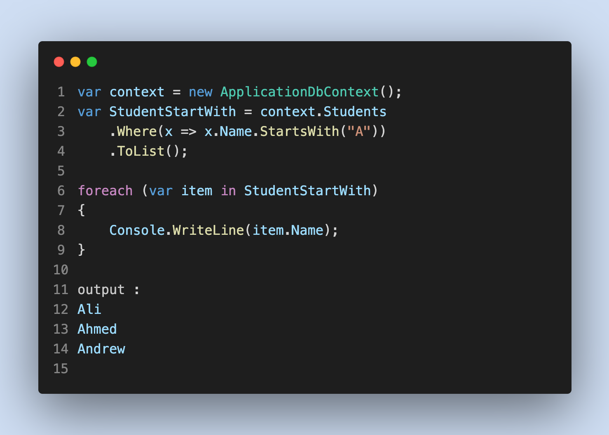

# Querying in Entity Framework Core  
##### EF Core has a new feature in LINQ-to-Entities where we can include C# or VB.NET functions in the query. This was not possible in EF 6.

### 🔴 Eager Loading
